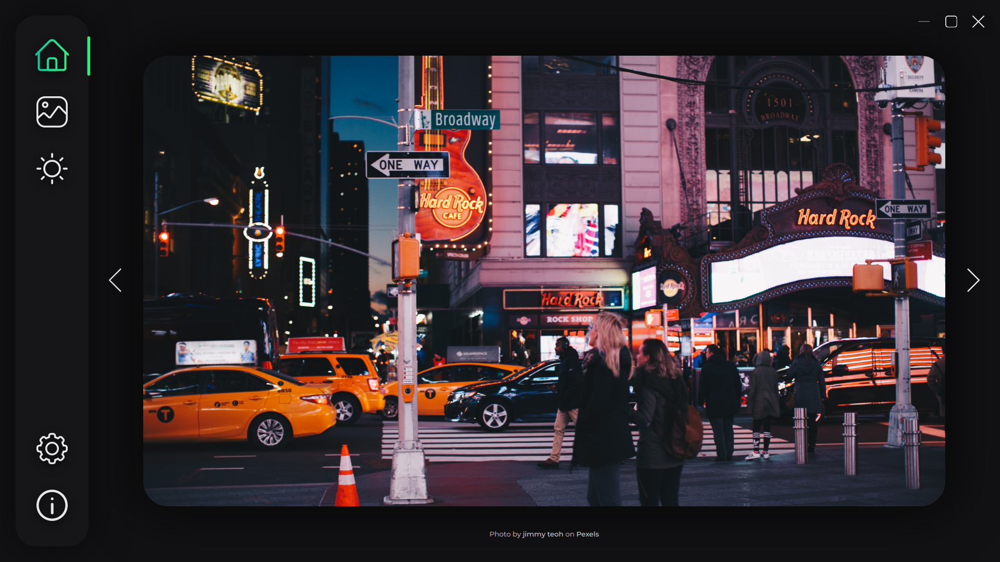
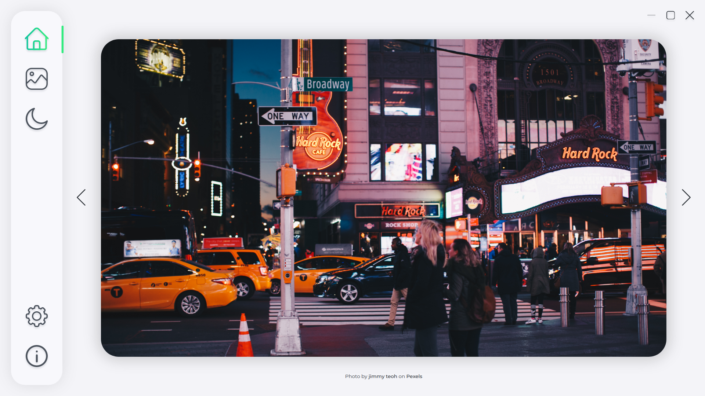
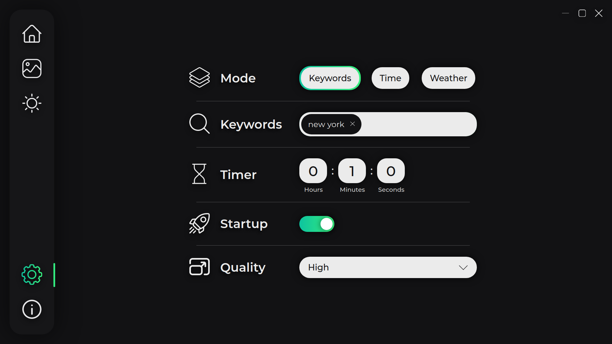
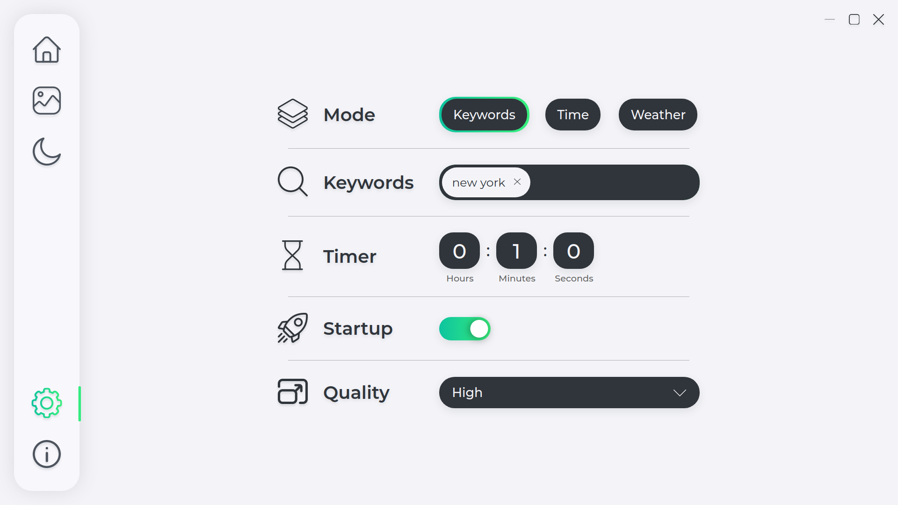
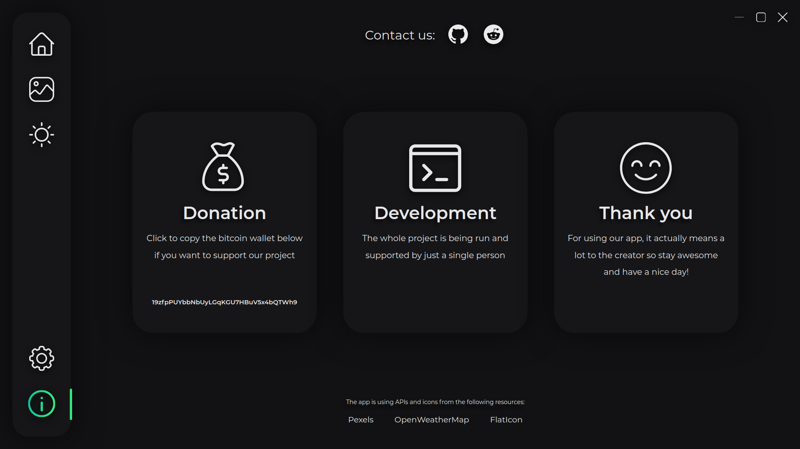
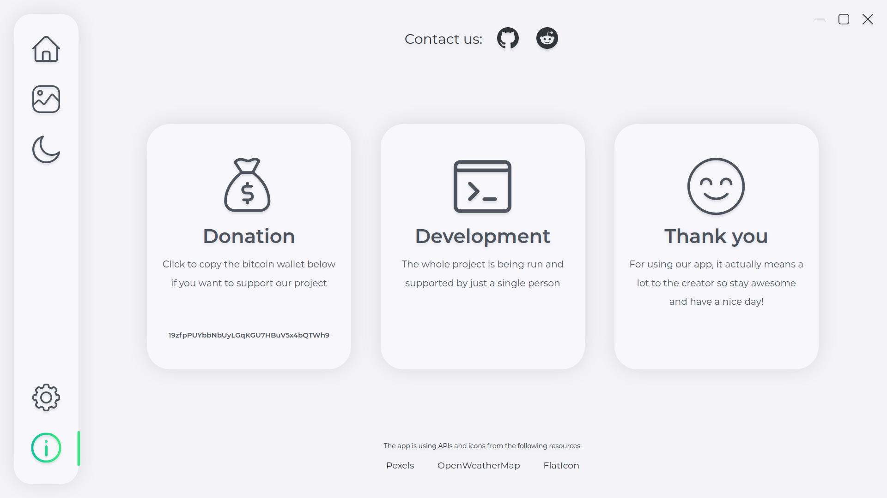

<div align="center">
  
  <h1>Erin</h1>
  <p>A cross-platform app for changing wallpaper</p>
</div>

## Goal
Erin has been created as an attempt to solve just one seemingly easy and, as I figured out later on, fairly common problem: getting used to your desktop wallpaper way too quickly while downloading them manually being too big of a hassle. If one's a software engineer, it's their moral duty to spend 100+ hours trying to automate a task that would take 10 minutes to complete manually in the worst of conditions, so that's exactly how Erin was born.

## Screenshots
|              | 
|------------------------------------------------------------|--------------------------------------------------------|
|          | 
|      | 
|              | 

## Installation

Download an installation file corresponding to your OS from [GitHub releases](https://github.com/losbiw/erin/releases/latest)

[](https://snapcraft.io/erin)

## Stack

Main technologies used in the project:
- Typescript
- React
- Electron
- Redux toolkit

## Local setup

**Setup**

Copy the repository using the following command:
```
git clone https://github.com/losbiw/erin
```
Include your own .env file (or use [the existing one](https://github.com/losbiw/erin/blob/master/electron/.env.example)) in the [electron directory](https://github.com/losbiw/erin/blob/master/electron) which has to contain the following variables:
* PEXELS_API_KEY
* WEATHER_API_KEY (OpenWeatherMap API is supported by default, in case of using another API you have to: 
  * Change hard-coded values in [weather.ts](https://github.com/losbiw/erin/blob/master/src/modules/weather.ts)
  * Change [req.main](https://github.com/losbiw/erin/blob/master/src/Components/User/User.tsx#L151) and [req.time](https://github.com/losbiw/erin/blob/master/src/Components/User/User.tsx#L155) to whatever your API returns instead
)
* GOOGLE_API_KEY
* GH_TOKEN (optional, but auto-updater won't work without it)

**Steps to run locally**

- Install dependencies: ```yarn install```
- Run react app: ```yarn react-start```
- Transpile electron code: ```yarn electron-compile```
- Run electron app: ```yarn electron-start```

**Commands to build the app on each platform**

- Windows: ```yarn build-win```
- Linux: ```yarn build-linux```
- MacOS: ```yarn build-mac```
- All three: ```yarn build-mwl```
